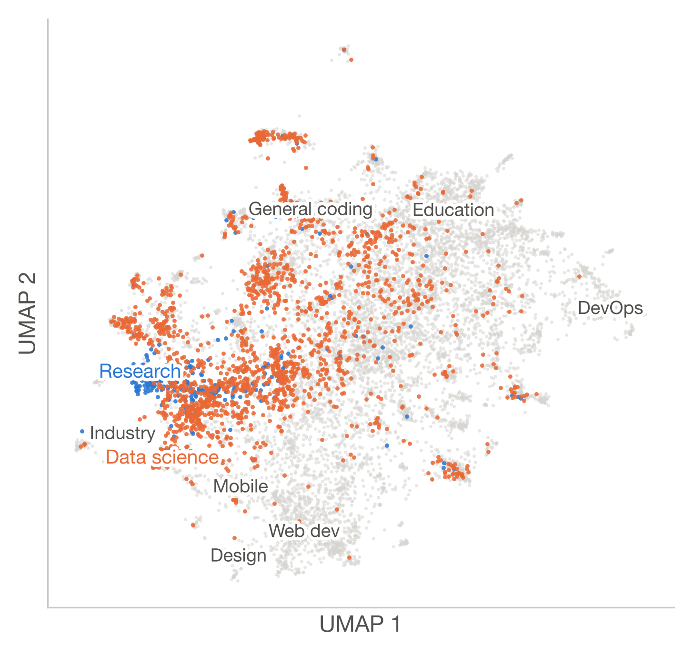
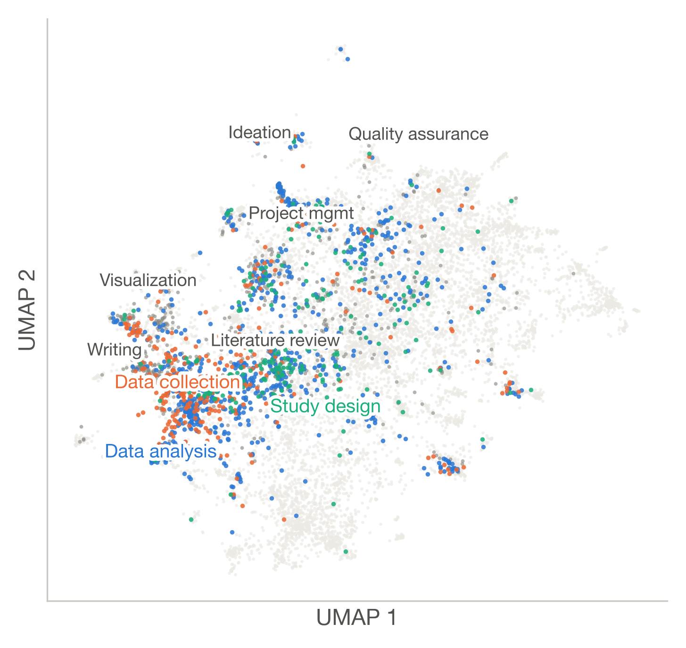

# SciSkillBank: A Dataset of Claude Code Skills for Scientific Research

This repository accompanies the paper of the same title. SciSkillBank is a dataset of 2,200
research-relevant GitHub repositories of Claude Code skills, with LLM annotations of workflow
stage, methodology encoding and autonomy. This first release contains Figure 2 of the paper,
the UMAP landscape of repository summaries. The dataset, the summary embeddings and the code
will be added to this repository later.

  
  

Figure 2: Embedding landscape of 11,613 valid repository summaries, projected with UMAP
(cosine distance, 15 neighbors, minimum distance 0.1). Research repositories form a band inside
the data-science region rather than a region of their own, and data analysis and data
collection co-locate within the research-relevant corpus. Left: full landscape with research
and data-science repositories highlighted; labels mark group density peaks. Right:
research-relevant corpus colored by primary workflow stage. The three most frequent primary
stages are highlighted, other stages are dark gray, and repositories outside the corpus are
light gray. Summaries take broad domain as an input, so the layout is not independent evidence
of domain structure, and axes and distances carry no quantitative meaning.

## Contents

| Path | What it is |
|---|---|
| `figures/fig2_umap.pdf` | Figure 2, both panels side by side |
| `figures/fig2_left_all_domains.pdf`, `.png` | Left panel |
| `figures/fig2_right_research_stages.pdf`, `.png` | Right panel |
| `requirements.txt` | Python dependencies of the code, which will be released here |
| `LICENSE` | CC BY 4.0 |

The PNG panels are the images used in the paper. The PDFs are drawn by the same script from the
same coordinates, with vector labels and the points rasterized at 400 dpi.

## License

CC BY 4.0; see `LICENSE`.
